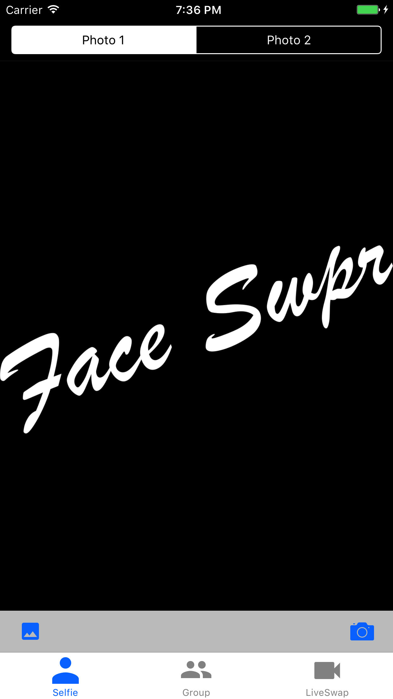
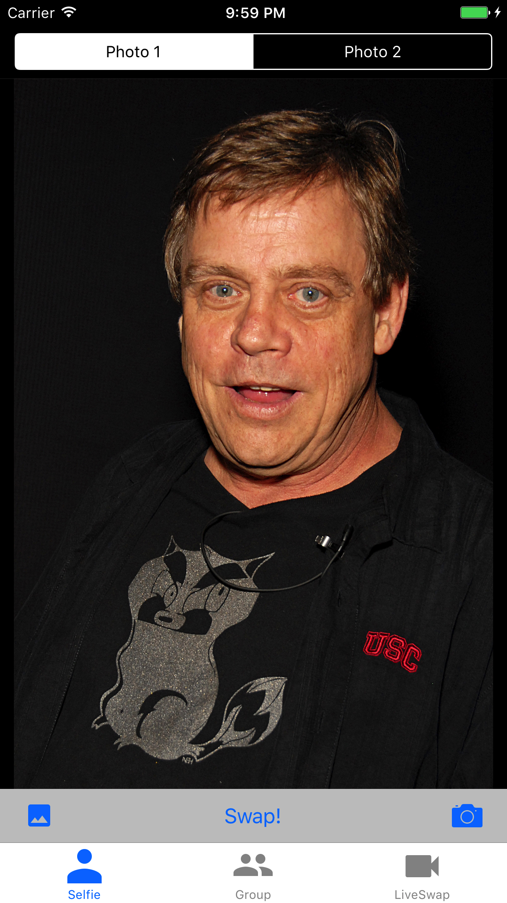
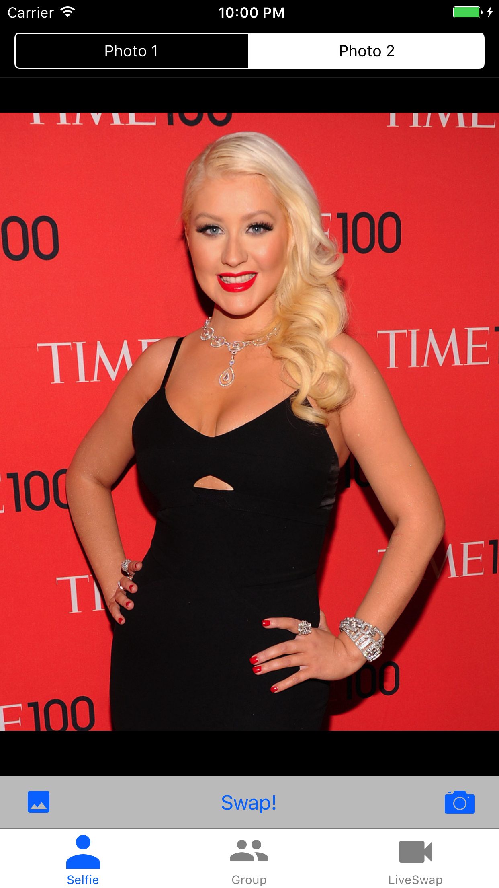
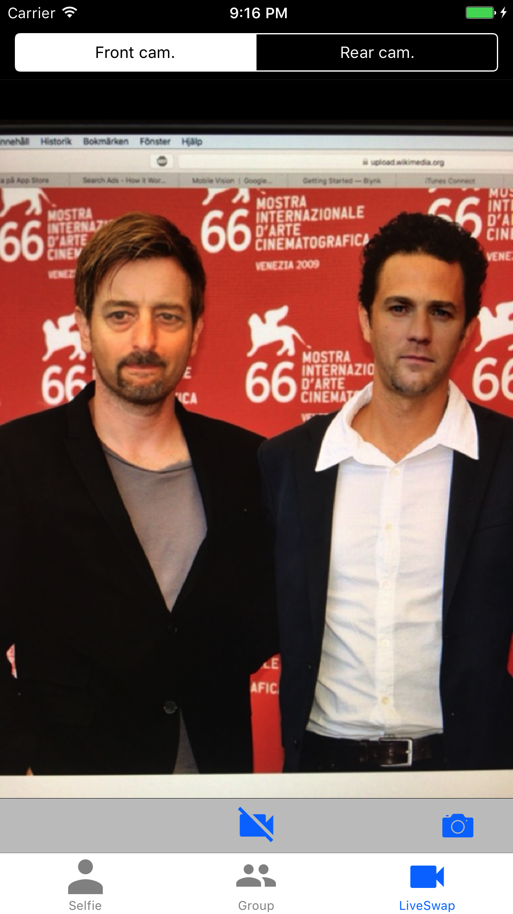

# FaceSwap_iOS
An iOS application for swapping faces.

The application called Face Swpr supports Selfie, Group and Live swapping of faces.

## Dependencies
* Unzip the file `opencv.framework.zip`. If the dependency for the OpenCv framework is missing, add it to your framworks in Xcode.
* You'll need the file `shape_predictor_68_face_landmarks.dat`in you path. If it's missing, unzip the file `shape_predictor_68_face_landmarks.dat.zip` and drag the file to you path in Xcode.
* The file `libdlib.a` is needed. Add it to frameworks if it's missing. dlib is built for iOS devices, which means that you can only use this project on iOS devices, and not on iOS emulators.

## Interface

## Examples
Here are some simple face swapping examples demonstrated.

### Selfie swapping
This mode offers face swapping of selfie photos. Below two (public domain) photos of Mark Hamill and Christina Aguilera are used for this example. For best possible result, the faces need to "look" in the same direction.

### Group swapping
Below is an example of group swapping shown. The input photo is photo of six cosmonauts, all faces will be swapped.

### Live swapping
In live mode we can swap faces in real time. Due to computational performance, the image resolution is very limited, but still it's fun to use.

